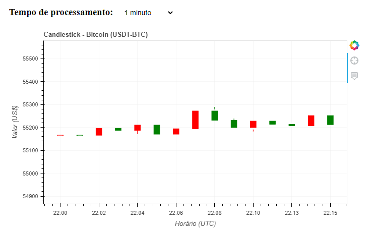
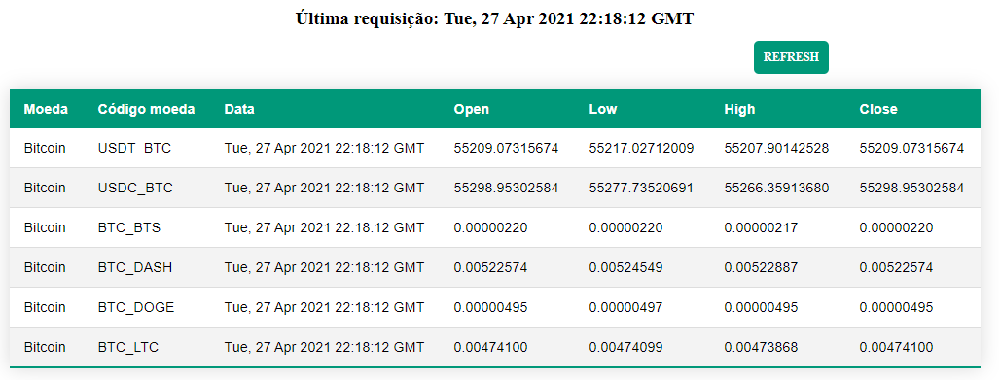

# Candlestick of Bitcoin


<!-- Sumário -->
<details open="open">
    <summary>Sumário </summary>
    <ol>
        <li><a href="#descrição">Descrição</a>
            <ul>
                <li><a href="#arquivos">Arquivos principais</a></li>
            </ul>
        </li>
        <li><a href="#detalhes-técnicos">Detalhes Técnicos</a></li>
        <li><a href="#etapas">Etapas</a></li>
        <li><a href="#instalação">Instalação</a>
            <ul>
                <li><a href="#pré-requisitos">Pré-requisitos</a></li>
                <li><a href="#para-reproduzir">Para reproduzir</a></li>
                <li><a href="#testes-unitários">Testes unitários</a></li>
                <li><a href="#rodar-localmente">Testar localmente</a></li>
            </ul>
        </li>
         <li><a href="#resultados">Resultados</a>
        <li><a href="#observações-e-dificuldades">Observações</a>
        <li><a href="#referências">Referências</a>
    </ol>
</details>

## Descrição

Aplicação em Flask usando biblioteca bokeh para construir candlesticks de valores do bitcoin extraídos da API Poloniex.
Objetivo: Processar cotações de criptomoedas (escolhi bitcoin USDT-BTC), agregá-las em candlesticks (com os dados de abertura, máxima, mínima e fechamento) e salvar em banco de dados dado um período escolhido.

### Arquivos

1. [app.py](https://github.com/nayaras/flask-bokeh-poloniex/blob/main/app.py): arquivo principal com criação do candlestick, redenrização do index.html e requisição da api poloniex
2. [db.py](https://github.com/nayaras/flask-bokeh-poloniex/blob/main/db.py): arquivo que realiza conexão com banco de dados e cria funções de crud (exceto delete)
3. [scatic folder](https://github.com/nayaras/flask-bokeh-poloniex/tree/main/static): possui um aquivo css com estilização básica para index.html e possui um arquivo de jquery com script que detecta seleção de tempo no dropdown
4. [templates folder](https://github.com/nayaras/flask-bokeh-poloniex/tree/main/templates): arquivos html, base (imports, resposividade etc), index (tela inicial, carrega candlestick e tabela), tabela (cria tabela de cotações)
5. [requirements.txt](https://github.com/nayaras/flask-bokeh-poloniex/blob/main/requirements.txt): bibliotecas python utilizadas (to reproduce: pip freeze > requirements.txt)
6. [init.sql](https://github.com/nayaras/flask-bokeh-poloniex/blob/main/init.sql): script de criação do bd/tabela principal
7. [docker-compose.yml](https://github.com/nayaras/flask-bokeh-poloniex/blob/main/docker-compose.yml) e [Dockerfile](https://github.com/nayaras/flask-bokeh-poloniex/blob/main/Dockerfile): arquivos de configuração do docker (imagens do python3.7-slim e mysql) 

## Detalhes técnicos

- Linguagem utilizada: Python  3.7 / Flask  
- Plataforma/Editor: Visual Studio Code
- Bibliotecas utilizadas: Disponível no arquivo requirements.txt
- Banco de dados: mysql
- Docker
- Testes unitários: pytest
- Fonte de dados: https://docs.poloniex.com/#public-http-api-methods (returnTicker)


## Etapas
1. Criação do arquivo base app.py
2. Instalação de pacotes necessários 
 ```sh
   pip install nome-pacote
   ```
3. Testes no virtualenv em modo de desenvolvimento
4. Refatoração do app.py com db.py (métodos de inserção, update e select)
5. Criação do ambiente no docker
6. Testes unitários


## Instalação

  ### Pré-requisitos
  1. Ter docker instalado
  
### Para reproduzir:
1. Clone o repositório
```sh
    git clone https://github.com/nayaras/flask-bokeh-poloniex.git
```
2. Executar docker-compose na pasta:
```sh
   docker-compose up
```
3. Abrir página web:
```sh
    localhost:5000
```
### Testes unitários:
1. Executar com:
```sh
    python -m pytest
```
    
### Rodar localmente:

1. Pré-requisitos:
- Python instalado (pip)
- Mysql server instalado

2. Clone repositório e abra o projeto no seu ambiente de desenvolvimento 
3. Instalar dependencias 
```sh
    pip install requirements.txt
```
5.  Instalar vitualenv
```sh
    pip install virtualenv
```
3. Ativar virtual env

```sh
    venv\Scripts\activate 
```
4. Setar variáveis de desenvovimento
```sh
    set FLASK_ENV=development
    set FLASK_APP=app.py
```
5. Rodar script de criação de banco de dados e tabela (usei workbench) [file: init.sql]
6. Rodar projeto:
```sh
    flask run
```
7. Abrir página web:
```sh
   localhost:5000
```
## Resultados
Candlesticks gerados das 19:00 às 19:16 do dia 27/04/2021 (reparem que o horário mostrado no gráfico se refere a UTC - Tempo Universal Coordenado, horário da requisição a API)




Tabela em tempo real (não é salva no bd, é carregada assim que a requisição a API da poloniex é feita)


 
 ## Observações e Dificuldades
 1. Apesar de ter familiaridade com python no desenvolvimento de scripts/consumo-desenvolvimento de apis (inclusive relacionadas a Google Cloud Platform), não tenho muita familiaridade com o Flask
 2. Testes unitários feitos somente em cima da renderização do template com seus componentes (testes relacionados ao bd ficam como demanda futura)
 3. [Dificuldade] A única solução para flask que encontrei para recarregar o gráfico do candlestick foi atualizar a página (via jquery), embora tenha testado soluções de renderizar somente a div ou uma parte do template html especifico (sem sucesso) 
 3.1. Como solução futura: trocar framework (talvez django resolva) ou estudar o bokeh server
 4. Testei o plotly para gerar a visualização do candlestick, mas para aplicação web achei o bokeh mais indicado
 5. A tabela presente só possui front (css e html puro) para mostrar a requisição atual, sem armazenamento de dados
 6. [Dificuldade] O docker estava iniciando o web app antes do bd, o que estava ocasionando erros (resolvido com a adição do healthcheck no docker-compose.yml)
 7. Testei local com uma lib de integração do flask com mysql e quando fui subir pro docker, nenhuma versão do python aceitava a instalação, o que me fez ter que usar o conector do mysql pra python (e perder um tempinho na readaptação)
 
 ## Referências
 1. Docker: https://docs.docker.com/compose/gettingstarted/
 2. Bokeh: https://docs.bokeh.org/en/latest/docs/gallery/candlestick.html / http://perfspy.blogspot.com/2017/03/candlestick-chart-using-boken-without.html
 3. Conector MySql: https://dev.mysql.com/doc/connector-python/en/connector-python-example-connecting.html
 4. Pytest para análise de renderização de template: https://stackoverflow.com/questions/57006104/how-to-test-flask-view-context-and-templates-using-pytest 
 
